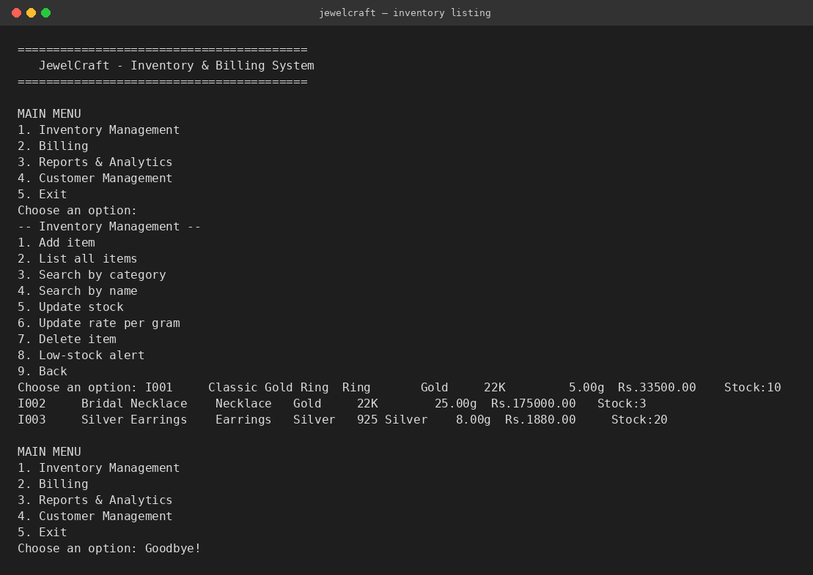
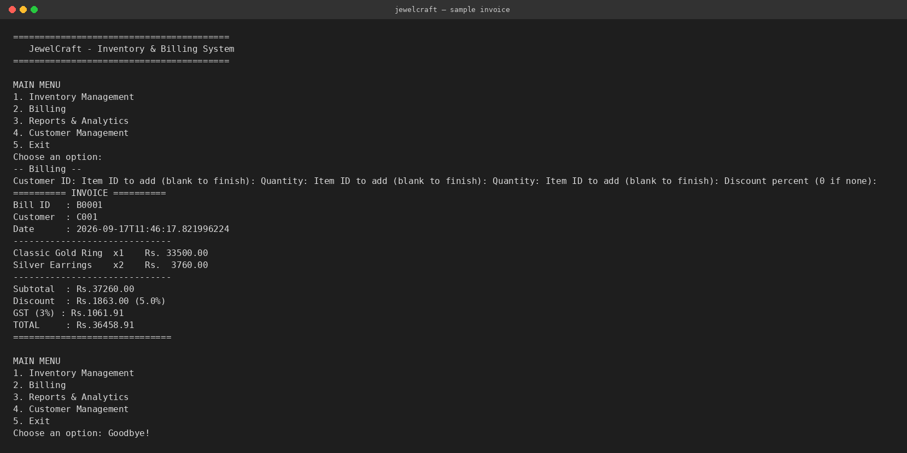

# JewelCraft — Jewellery Inventory & Billing System

A command-line Java application for managing a jewellery store's inventory,
raising customer invoices with automatic GST calculation, and generating
sales/stock reports. Built as the course project for **Programming in Java**.

## Why this project

Jewellery pricing is unusual: the sale price of an item isn't fixed — it's
recalculated from the current gold/silver rate plus a making charge every
time it's sold. That makes it a genuinely interesting domain for practising
OOP, layered architecture, exception handling and file-based persistence,
rather than a generic to-do-list clone.

## Features

- **Inventory Management** — add, update, delete, search (by category / name
  keyword) jewellery items; live low-stock alerts.
- **Billing** — build a multi-item invoice for a customer, auto-checks stock
  before committing, applies an optional discount, then adds 3% GST and
  prints a formatted invoice.
- **Reports & Analytics** — all-time sales summary (revenue, GST collected),
  top-selling items, low-stock report.
- **Customer Management** — add and list customers a bill can be raised
  against.
- Every action is validated (`Validator` class) and wrapped in custom
  checked exceptions (`ItemNotFoundException`, `InsufficientStockException`,
  `InvalidInputException`) so bad input never crashes the app.
- Data persists between runs as plain CSV files under `data/` — no database
  install required to run or evaluate this project.

## Technologies / Tools Used

- **Java 17+** (core language, no external libraries) — `java.util`,
  `java.io`, `java.nio.file`, `java.time`, `java.util.stream`
- Plain CSV files for persistence (chosen over a DB to keep the project
  runnable with nothing but a JDK)
- Git / GitHub for version control

## Project Structure

```
src/com/jewelcraft/
  model/        JewelryItem, Customer, BillItem, Bill
  exception/    JewelCraftException (base) + 3 specific subclasses
  util/         Validator (centralised input validation)
  repository/   InventoryRepository, CustomerRepository, BillRepository (CSV I/O)
  service/      InventoryService, CustomerService, BillingService, ReportService
  Main.java     CLI menu and application entry point
```

Layering: `Main` (presentation) → `service` (business logic) → `repository`
(persistence) → `model` (data). Each layer only talks to the one directly
below it, so, e.g., the storage format can be swapped for a real database
later without touching the business logic.

## Setup & How to Run

### Prerequisites
- JDK 17 or newer installed (`java -version` and `javac -version` should
  both work in your terminal). No other dependency is required.

### 1. Clone the repository
```bash
git clone https://github.com/<your-username>/<repo-name>.git
cd <repo-name>
```

### 2. Compile
From the repository root:
```bash
find src -name "*.java" > sources.txt
javac -d out @sources.txt
```
(On Windows PowerShell, replace the first line with:
`Get-ChildItem -Recurse -Filter *.java src | ForEach-Object { $_.FullName } > sources.txt`)

### 3. Run
```bash
java -cp out com.jewelcraft.Main
```

The app prints a menu-driven CLI. On first run it seeds a few demo items
(`I001`, `I002`, `I003`) and one demo customer (`C001`) so you can try
billing immediately without entering data by hand — you're free to add
your own as well.

### 4. Try it — a 30-second walkthrough
1. From the main menu choose `2` (Billing).
2. Customer ID: `C001`
3. Item ID: `I001`, Quantity: `1`, then leave the next Item ID blank to finish.
4. Discount percent: `5`
5. The app prints a full invoice with subtotal, discount, 3% GST and total.
6. Choose `3` → `1` from the main menu to see the sales summary update.

All data you enter is saved to `data/*.csv` and reloaded automatically the
next time you run the program.

## Instructions for Testing

There's no separate test framework (kept dependency-free for easy
evaluation) — the CLI itself doubles as the test harness:

- **Validation**: try adding an item with a blank name or a negative
  weight — the app rejects it with a clear message and returns to the menu.
- **Insufficient stock**: try billing more units of an item than its
  displayed stock — the app throws `InsufficientStockException` and the
  bill is *not* created (no partial stock deduction).
- **Unknown ID**: try looking up or billing an item/customer ID that
  doesn't exist — the app throws `ItemNotFoundException` gracefully.
- **Persistence**: exit the app (`5`) and relaunch — inventory, customers
  and bill history are all still there.

## Design Diagrams

`docs/` contains the system architecture, use case, workflow, class, sequence
and storage-schema diagrams (as both rendered `.png` and editable `.mmd`
Mermaid source) referenced in the project report.

## Screenshots




(Feel free to replace these with screenshots from your own terminal run
before final submission.)
